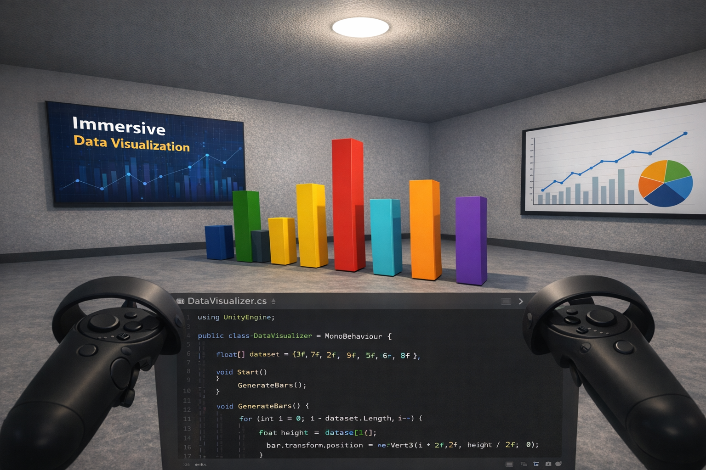

# VR Immersive Data Visualization

A simple virtual reality project built using Unity that demonstrates how datasets can be visualized as **3D bar charts in an immersive environment**.

## Project Preview



*Conceptual preview of the VR data visualization environment.*

The current implementation generates a **3D bar chart from a dataset using Unity**.

## Features

* 3D bar chart visualization generated from dataset values
* Simple immersive VR environment for exploring data visually
* Implemented using Unity and C#

## Project Structure

```
vr-immersive-data-visualization
│
├── README.md
├── LICENSE
├── .gitignore
│
├── Assets
│   └── Scripts
│       └── DataVisualizer.cs
│
└── images
    └── vr_visualization.jpg
```

## Technologies Used

* Unity
* C#

## How It Works

The script reads a dataset and generates 3D bars where the **height of each bar represents the value in the dataset**.

Example dataset used in the script:

```
3, 7, 2, 9, 5, 6, 8
```

Each value is converted into a 3D bar inside the Unity scene.

## Future Improvements

* Load datasets from external files
* Support additional chart types
* Add interactive VR exploration of data

## Author

Adeeba Nizam
